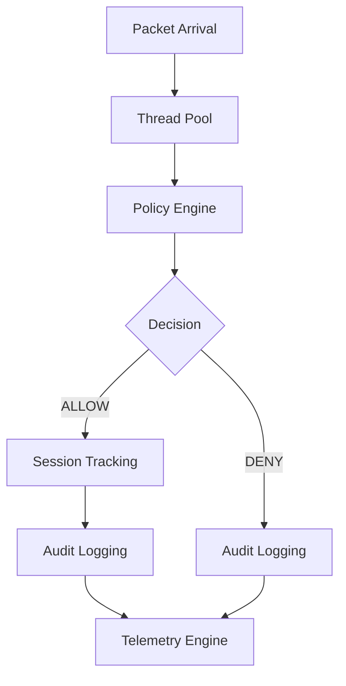
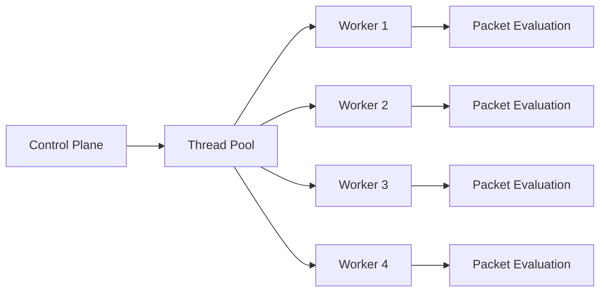

# 🔥 Distributed Firewall Control Plane OS Simulator


---

# 🚀 Overview

Distributed Firewall Control Plane OS Simulator is a production-style cybersecurity infrastructure simulator written in **Modern C++17**.

The project simulates the internal architecture of:

- Enterprise Firewalls
- Distributed Security Appliances
- Clustered Control Planes
- Packet Inspection Engines
- Stateful Session Tracking Systems
- Telemetry & Audit Pipelines

This simulator demonstrates real-world systems programming concepts including:

✅ Multi-threaded packet processing  
✅ Distributed cluster simulation  
✅ Firewall policy evaluation  
✅ Stateful session tracking  
✅ Audit logging  
✅ Telemetry pipelines  
✅ Thread pools  
✅ Centralized logging  
✅ Concurrent packet execution  
✅ Production-style modular architecture

---

# 🧠 Why This Project Matters

Modern enterprise firewalls rely on:

- distributed control planes
- concurrent packet processing
- telemetry systems
- stateful packet inspection
- audit pipelines
- scalable worker architectures

This project demonstrates these concepts in a simplified but production-inspired implementation.

It serves as a strong learning platform for:

- cybersecurity engineering
- distributed systems
- systems programming
- concurrent C++
- firewall architecture
- network security research

---

# 🏗️ System Architecture

```text
                           ┌─────────────────────┐
                           │   Control Plane     │
                           │  (core/controller)  │
                           └─────────┬───────────┘
                                     │
         ┌───────────────────────────┼──────────────────────────┐
         │                           │                          │
         ▼                           ▼                          ▼
┌─────────────────┐      ┌──────────────────┐      ┌──────────────────┐
│ Cluster Manager │      │  Policy Engine   │      │  Thread Pool     │
│ Leader Election │      │ Rule Evaluation  │      │ Worker Threads   │
└────────┬────────┘      └────────┬─────────┘      └────────┬─────────┘
         │                        │                         │
         │                        ▼                         │
         │              ┌──────────────────┐                │
         │              │ Packet Flow Eval │                │
         │              └────────┬─────────┘                │
         │                       │                          │
         ▼                       ▼                          ▼
┌─────────────────┐    ┌──────────────────┐      ┌──────────────────┐
│ Session Tracker │    │   Audit Logger   │      │ Telemetry Engine │
│ Active Sessions │    │ Security Events  │      │ Metrics Summary  │
└─────────────────┘    └──────────────────┘      └──────────────────┘
```

---

# 🔄 Packet Flow Pipeline



---

# 🧵 Worker Thread Architecture



---

# 📂 Project Structure

```text
Distributed-Firewall-Control-Plane-OS-Simulator/
│
├── audit/
│   └── audit_logger.cpp
│
├── build/
│
├── cluster/
│   └── cluster_manager.cpp
│
├── core/
│   └── control_plane.cpp
│
├── policy/
│   └── policy_engine.cpp
│
├── session/
│   └── session_table.cpp
│
├── telemetry/
│   └── metrics.cpp
│
├── util/
│   ├── logger.cpp
│   └── logger.hpp
│
├── worker/
│   └── thread_pool.cpp
│
├── include/
│
├── docs/
│   ├── architecture.png
│   ├── runtime-preview.png
│   └── fwos-demo.gif
│
├── main.cpp
├── CMakeLists.txt
├── LICENSE
└── README.md
```

---

# ⚙️ Core Components

---

## 1️⃣ Control Plane

Responsible for:

- booting the firewall OS
- orchestrating subsystems
- scheduling packet flows
- launching worker threads

### File

```text
core/control_plane.cpp
```

---

## 2️⃣ Cluster Manager

Simulates distributed firewall clustering.

### Features

- leader election
- heartbeat service
- policy replication

### Example

```bash
[CLUSTER] node-1 elected leader
[CLUSTER] heartbeat service started
[CLUSTER] policy replication enabled
```

---

## 3️⃣ Policy Engine

Evaluates incoming network flows.

### Current Policy Rules

| Protocol | Port | Action |
|----------|------|---------|
| TCP | 443 | ALLOW |
| UDP | 53 | DENY |

### Example

```bash
[TRACE] 10.1.1.2 -> 8.8.8.8 proto=tcp port=443 verdict=ALLOW
```

---

## 4️⃣ Session Tracking

Maintains active connection state.

Simulates:

- conntrack
- NAT tables
- enterprise firewall sessions

### Example

```bash
[SESSION] active=42
```

---

## 5️⃣ Audit Logging

Generates security audit events.

Useful for:

- SOC monitoring
- SIEM ingestion
- incident response
- compliance auditing

### Example

```bash
[AUDIT] 10.1.1.42 -> 10.0.0.1 DENY
```

---

## 6️⃣ Telemetry Engine

Tracks:

- allowed packets
- denied packets
- traffic statistics
- runtime metrics

### Example

```bash
========== FIREWALL SUMMARY ==========
allowed packets: 25
denied packets : 25
```

---

## 7️⃣ Thread Pool

Implements:

- concurrent packet processing
- worker scheduling
- asynchronous execution

This simulates real firewall packet pipelines.

---

# 🔐 Packet Processing Lifecycle

```text
Packet Arrives
      │
      ▼
Thread Pool Worker
      │
      ▼
Policy Engine Evaluation
      │
      ├── ALLOW
      │      │
      │      ▼
      │  Session Tracking
      │      │
      │      ▼
      │  Audit Logging
      │      │
      │      ▼
      │  Telemetry Metrics
      │
      └── DENY
             │
             ▼
        Audit Logging
             │
             ▼
        Telemetry Metrics
```

---

# 🛠️ Build Instructions

## Requirements

Install:

- GCC 13+
- CMake 3.16+
- Linux / WSL / GitHub Codespaces

### Verify Installation

```bash
g++ --version
cmake --version
```

---

# 🔨 Build Project

## Step 1 — Clone Repository

```bash
git clone <repository-url>
cd Distributed-Firewall-Control-Plane-OS-Simulator
```

---

## Step 2 — Create Build Directory

```bash
mkdir build
cd build
```

---

## Step 3 — Generate Build Files

```bash
cmake ..
```

### Expected Output

```bash
-- Configuring done
-- Generating done
-- Build files have been written to:
```

---

## Step 4 — Compile

```bash
make -j4
```

### Expected Output

```bash
[100%] Built target fwos-x
```

---

# ▶️ Run Simulator

```bash
./fwos-x
```

---

# 🖥️ Example Runtime Output

```bash
[FWOS] booting distributed firewall OS

[CLUSTER] node-1 elected leader
[CLUSTER] heartbeat service started
[CLUSTER] policy replication enabled

[POLICY] loaded 2 rules

[SESSION] active=1
[AUDIT] 10.1.1.0 -> 10.0.0.1 DENY
[TRACE] 10.1.1.0 -> 10.0.0.1 proto=tcp port=443 verdict=DENY

[SESSION] active=2
[AUDIT] 10.1.1.1 -> 8.8.8.8 DENY
[TRACE] 10.1.1.1 -> 8.8.8.8 proto=udp port=53 verdict=DENY

[SESSION] active=3
[AUDIT] 10.1.1.2 -> 8.8.8.8 ALLOW
[TRACE] 10.1.1.2 -> 8.8.8.8 proto=tcp port=443 verdict=ALLOW

========== FIREWALL SUMMARY ==========
allowed packets: 25
denied packets : 25

[FWOS] shutdown complete
```
---

# 🧵 Multithreading Design

The simulator uses:

```cpp
ThreadPool pool(4);
```

This launches:

- 4 worker threads
- concurrent flow processing
- asynchronous packet evaluation

### Benefits

✅ Better throughput  
✅ Realistic packet scheduling  
✅ Parallel execution  
✅ Scalable architecture

---

# 🔒 Centralized Logging System

The simulator uses:

```cpp
std::mutex globalLogMutex;
```

Purpose:

- synchronized console output
- prevents log corruption
- thread-safe tracing

### Without Synchronization

```bash
[TRACE] [SESSION] active=10.1.1.42
```

### With Synchronization

```bash
[SESSION] active=42
[AUDIT] 10.1.1.42 -> 10.0.0.1 DENY
```

---

# 📊 Telemetry Summary

| Metric | Description |
|--------|-------------|
| Allowed Packets | Successful flows |
| Denied Packets | Blocked flows |
| Active Sessions | Connection count |
| Audit Events | Security logs |

---

# 🏗️ Production-Level Concepts Demonstrated

| Technology | Simulated |
|------------|------------|
| Firewall Control Plane | ✅ |
| Distributed Systems | ✅ |
| Session Tracking | ✅ |
| Thread Pools | ✅ |
| Packet Inspection | ✅ |
| Cluster Replication | ✅ |
| Telemetry Pipelines | ✅ |
| Audit Logging | ✅ |
| Concurrent Processing | ✅ |
| Policy Evaluation | ✅ |

---

# 🎯 Skills Demonstrated

- Modern C++17
- Multithreading
- Mutex Synchronization
- Distributed Systems
- Network Security
- Firewall Architecture
- Thread Pools
- Session Tracking
- Telemetry Systems
- Concurrent Programming
- Linux Systems Programming
- CMake Build Systems

---

# 🚀 Future Enhancements

## Planned Features

### ✅ JSON Policy Loader

Using:

```cpp
nlohmann/json
```

Example:

```json
{
  "protocol": "tcp",
  "port": 443,
  "action": "allow"
}
```

---

## ✅ REST API

Possible libraries:

- Boost.Beast
- Crow
- Pistache

Endpoints:

```text
/metrics
/rules
/flows
/sessions
```

---

## ✅ Real Packet Capture

Integrations:

- libpcap
- raw sockets
- eBPF

---

## ✅ Real-Time Dashboard

Potential integrations:

- ncurses UI
- Grafana exporter
- Prometheus metrics

---

## ✅ Multi-Node Cluster Simulation

```text
          ┌───────────┐
          │  Leader   │
          └─────┬─────┘
                │
    ┌───────────┼───────────┐
    ▼           ▼           ▼
┌────────┐ ┌────────┐ ┌────────┐
│ Node-2 │ │ Node-3 │ │ Node-4 │
└────────┘ └────────┘ └────────┘
```

---

# 📈 Performance Characteristics

| Feature | Current |
|---------|----------|
| Worker Threads | 4 |
| Packet Flows | 50 |
| Logging | Thread-Safe |
| Architecture | Modular |
| Build System | CMake |
| Language | C++17 |

---

# 🧪 Testing Commands

## Rebuild From Scratch

```bash
cd /workspaces/Distributed-Firewall-Control-Plane-OS-Simulator

rm -rf build
mkdir build
cd build

cmake ..
make -j4
```

---

## Run Simulator

```bash
./fwos-x
```

---

## Verify Binary Exists

```bash
ls -l ./fwos-x
```

---

## Show Full Binary Path

```bash
realpath ./fwos-x
```

---

# 🛡️ Security Concepts Simulated

The simulator mimics:

- ACL Enforcement
- Stateful Firewalling
- Traffic Filtering
- Security Audit Pipelines
- Distributed Control Planes
- Runtime Telemetry
- Session Management
- Packet Classification

---

# 🔧 GitHub Actions CI

Create:

```text
.github/workflows/build.yml
```

Example:

```yaml
name: C++ Build

on:
  push:
  pull_request:

jobs:
  build:
    runs-on: ubuntu-latest

    steps:
    - uses: actions/checkout@v4

    - name: Install Dependencies
      run: sudo apt-get install -y cmake g++

    - name: Build Project
      run: |
        mkdir build
        cd build
        cmake ..
        make -j4
```

---

# 👨‍💻 Author

Built using:

- C++17
- Modern concurrency
- Linux threading
- CMake
- Distributed systems concepts
- Cybersecurity architecture principles

---

# 📜 License

MIT License

---

# ⭐ Star This Project

If you found this project useful for learning:

- distributed systems
- firewall architecture
- cybersecurity engineering
- multithreaded C++
- packet processing
- systems programming

consider giving it a ⭐ on GitHub.

---